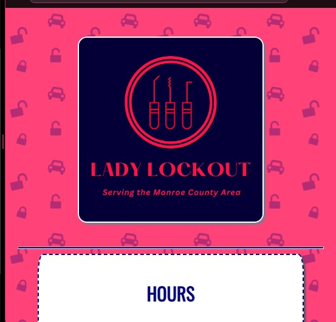
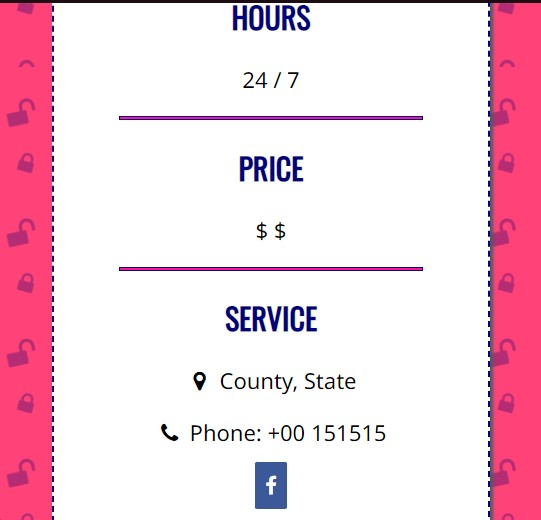
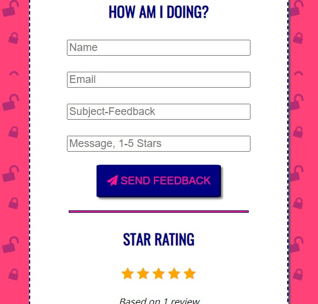

<p align="center">

</p>

<h1 align="center">Lady Lockout</h1>

<p align="center">Locksmith Business Website<br>
HTML and CSS only. For production enviornments, you can use something like <a href="https://usebasin.com">Basin Forms</a> for the form backend.</p>

<p align="center">

</p>

## Screenshots

<p align="center">



</p>

## Installation

Clone the project

```bash
git clone...
```

Go to the project directory

```bash
cd ...
```

That's it! Edit it and host it however you choose. <br>
(Ex. github pages, vercel, etc.)

## License

[APACHE-2.0](https://choosealicense.com/licenses/apache-2.0)

## Author

<p><a href="https://lesley-nicole.github.io"></a></p>
